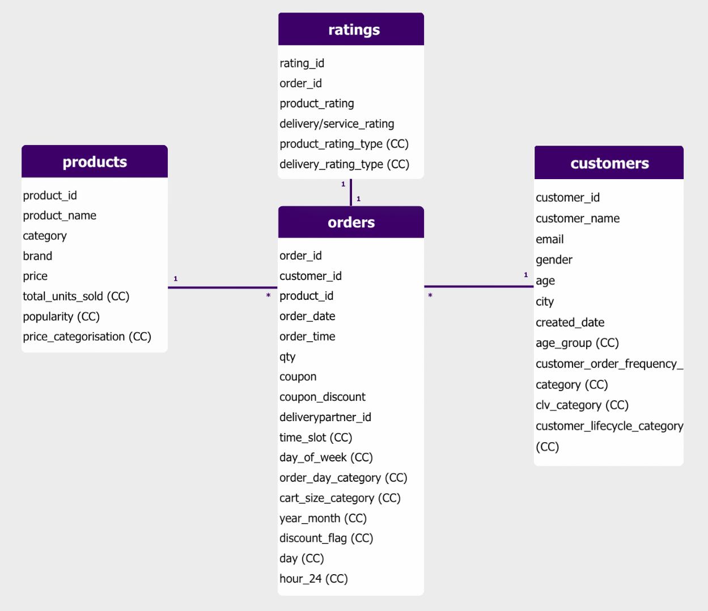
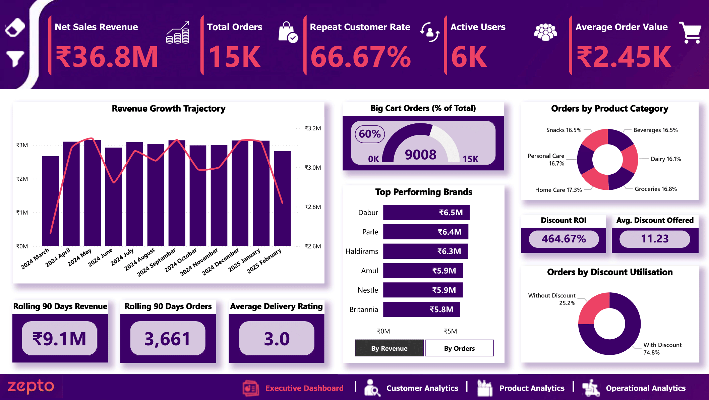
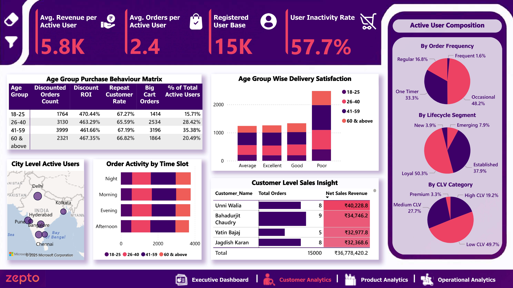
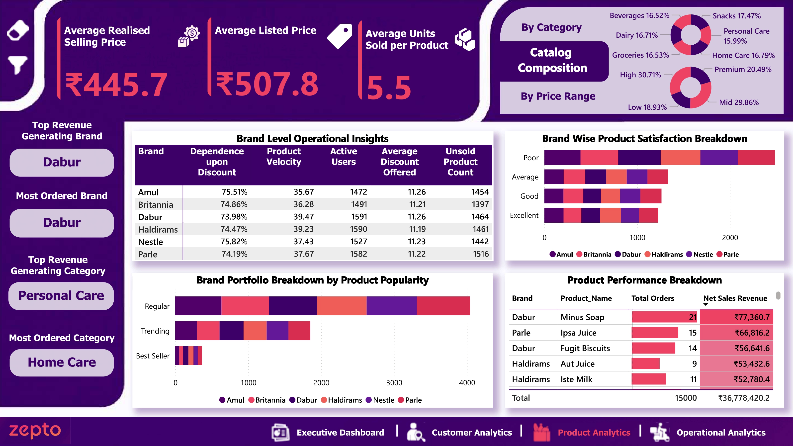
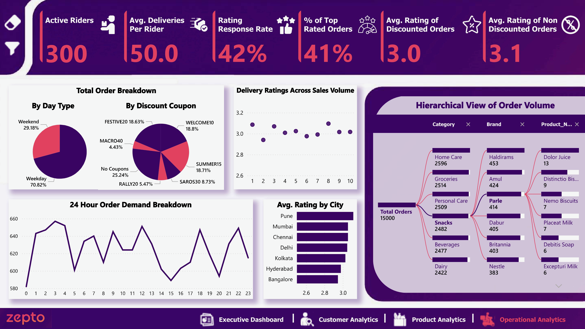

# Zepto Data Analysis | PowerBI Dashboard | FY25

Table of Contents

- [Project Background](#project-background)
- [Data Description](#data-description)
    - [Key DAX Measures, Data Normalisation, Modelling & Dashboard Navigations](#key-dax-measures-data-normalisation-modelling--dashboard-navigations)
- [Executive Summary](#executive-summary)
- [In-Depth Analysis](#in-depth-analysis)
    - [Executive Dashboard](#executive-dashboard)
    - [Customer Analytics](#customer-analytics)
    - [Product Analytics](#product-analytics)
    - [Operational Analytics](#operational-analytics)
- [Recommendations](#recommendations)

***

## Project Background

Zepto, founded in 2021, is a prominent quick-commerce company in the Indian market with an estimated 29% market share. However, recent results from Q1 FY26 reveal a slowdown in gross order value (GOV), combined with a heavy burn rate and ongoing negative cash flow. Growth has been outpaced by rivals such as Instamart and Blinkit, while sharp competition from new entrants including Flipkart’s Minutes and Amazon’s AmazonNow has further intensified market pressures and fueled discount wars.

This project leverages a Power BI dashboard built on simulated Zepto data for demonstration purposes, to analyse business metrics from March 2024 through FY25. By exploring customer behaviour, product performance, and operational efficiency, the dashboard aims to deepen understanding and identify growth prospects for the business.

## Data Description

The dataset is structured in a star schema, with the Orders table serving as the central fact table and the Products, Ratings, and Customers tables as dimensions.

- Orders: The core fact table records each successful order, including order date and time, discount percentage, and quantity. This enables detailed segmentation to track purchasing behavior and trends. Key calculated columns include time slot, order day category, cart size category, and discount flag.

- Products: Contains information on all listed SKUs, such as brand name, category, and price. This table supports broad classification of order and revenue trends. Key calculated columns include price categorisation, popularity levels, and total units sold.

- Customers: Captures the demographics of the registered user base, including age, city, and gender. This enables analysis of the target audience and the effectiveness of marketing campaigns by segment. Key calculated columns include age group, CLV category, customer lifecycle segment, and order frequency category.

- Ratings: Records product and delivery/service ratings linked to each rated order, supporting analysis of customer satisfaction and delivery operational efficiency. Key calculated columns include the segmentation of product and delivery ratings into qualitative categories

## Key DAX Measures, Data Normalisation, Modelling & Dashboard Navigations

The raw simulated data was cleaned and normalised using Power Query to resolve inconsistencies such as duplicates, blanks, repetitions, and redundancy. The data model was further enhanced through categorisation, leveraging calculated columns as described above.

Key DAX measures were developed to elevate analytical depth and insight, including repeat purchase rate, revenue net of discounts, average realised selling price, average order value, product velocity, discount ROI (in terms of revenue), discount dependence, user inactivity rate, running 90-day order and revenue totals, and more. These measures enabled comprehensive coverage of all key business aspects represented in the dataset.

The dashboard also features a custom filter panel, drill-through capabilities for categorical analytics, intuitive page navigation buttons, and custom tooltip for line column chart. Additional tools such as the AI-powered decomposition tree and field parameter slicer are included to support flexible exploration and a smoother user experience.

Note: As this dataset is synthetic and intended for portfolio demonstration, certain values may not reflect Zepto’s actual business metrics. The data covers the period from March 2024 to February 2025, with incomplete March 2025 figures shown as running totals.

## Executive Summary

Zepto, operating in a rapidly evolving and competitive landscape, continued to grow from March 2024 through March 2025, averaging ₹3 million in revenue and 1,250 orders per month. However, expected festive season surges were not realized, despite 18.63% of orders being driven by festive discounting, and a decline was observed toward the close of Q4.

Big cart orders accounted for 60% of total orders, with an average cart size of ₹2,450 and a repeat customer rate of 66.67%. While discount ROI was effective at 464.67%, discount dependence remained above 74% for all listed brands. Additionally, over 1,400 SKUs per brand remained unsold, potentially adding to burn rate and margin pressures.

A user inactivity rate of 57.7%, combined with a 49.7% share of low-CLV users, 81.5% of orders from low-frequency users, and just 3.9% new active users, highlights substantial untapped potential. The 18-25 age group remained the least active (15.71%), while the 41-59 group was the most active (35.38%).

Home Care led in total orders, while Personal Care generated the highest revenue. Dabur was the top brand for both revenue and order share, though it also recorded the most low-ratings for its products. Product velocity remained above 35 across all brands, with the catalog comprising a substantial 51.2% of high price end SKUs.

Average delivery and service ratings remained at approximately 3.0, regardless of discounting, order volumes, or city with Bangalore (despite being in the top three cities) recording the lowest satisfaction rate. Delhi continued to lead in distinct users (1,439), with Pune and Kolkata emerging as growth markets (collectively 1,025). Weekends saw expected order surges (29.18%), while a notable late-night window (1 AM to 3 AM) showed an additional spike in orders. However, the number of active riders (300) and deliveries per rider (50) remain limited, pointing to ongoing operational capacity constraints.

## In-Depth Analysis

## Executive Dashboard

- Zepto’s revenue trended upward post March 2024, averaging ₹3 million monthly. However, festive season sales in October and November fell below both the expected peak and the usual average, likely due to festive upsurge fees and rising competition.
  
- Net sales revenue reached ₹36.8 million on 15,000 orders, with a strong repeat customer rate of 66.67% and an average cart size of ₹2,450, possibly driven by Zepto’s “Super Saver” offers. However, active users (6,000) remain relatively low, pointing to a potential gap in customer engagement.
  
- Discounts were utilised in 74.8% of orders, with an average discount rate of 11.23%. While this approach continues to support order volumes and an effective discount ROI (464.67%), sustained discounting could impact overall margins.
  
- Dabur leads brand contributions with ₹6.5 million in sales, while category orders are more evenly distributed, with Home Care taking the top spot at 17.3%.
  
- Rolling 90-day figures (as of March 2025) indicate a decline in revenue and order trends at the close of Q4 FY25. Furthermore, an average customer satisfaction rating of 3.0 raises concerns, particularly given the lowered active user base during this period.

## Customer Analytics

- The 41-59 age group accounts for the highest active usage (35.38%) , repeat rate (67.19%), and maximum big cart orders (3999), as well as strong responsiveness to discounts. In contrast, the 18-25 age group, while delivering the highest ROI (470.44%) to discount campaigns, lags behind in average order contribution.
  
- Low engagement is reflected by a high proportion of low-CLV users (49.7%), new and emerging users (collectively 11.2%), and a collective one-timer and occasional order frequency of 81.5%. This is further exacerbated by a user inactivity rate of 57.7%, representing significant untapped potential among the 15,000 registered users.
  
- Delhi, Mumbai, and Bengaluru drive the highest number of distinct users, while Pune and Kolkata are emerging as growth markets. Order activity is distributed equitably across time slots, with afternoon periods dominated by the highly active 41-59 age group, and night slots most popular among the lower-contributing 18-25 age group.
  
- Despite high usage, delivery and service dissatisfaction rates are elevated for the 26-40 and 41-59 age groups. Notably, the 60+ age group recorded an astounding 814 poor and average reviews, indicating a need for targeted service improvements. CLV among users varies widely, from less than ₹50 to a maximum of ₹40,228.8.

## Product Analytics

- There is a sharp ₹62.1 difference between the average listed price (₹507.8) and the average realized selling price (₹445.7), reflecting the impact of discounting campaigns, as seen with all brands showing over 74% discount dependence and discount rates above 11.2%.
  
- The average units sold per product remains low at 5.5, which can be attributed to approximately 1,400+ unsold products per brand potentially adding to inventory holding costs.
  
- A combined 51.2% share of premium and high-range products may contribute to the elevated average order size seen previously. While the catalog is nearly evenly split by category, Snacks leads in product count at 17.47% but does not rank among the top categories for orders or revenue generation.
  
- Dabur stands out with the highest order volume, revenue, product velocity (39.47), and number of best sellers (72) including the top revenue-generating product (Minus Soap at ₹77,360.7). However, its products collectively receive the most poor and average ratings (683).
  
- The Personal Care category, though the smallest portion of the catalog, is the highest in terms of revenue generated, while Home Care leads in total orders. Nestle accounts for the largest number of regular selling products (726), whereas Haldiram holds the maximum number (432) of top ratings.

## Operational Analytics

- The anticipated weekend order surge holds true, with weekends contributing 29.18% of total orders. Notably, festive and summer discounting drive 18.63% and 18.71% of orders respectively, however, revenue during these promotional months remains below average (around ₹3 million), raising concerns about organic retention and profitability.
  
- A surprising surge in late-night orders (1 AM to 3 AM) is observed throughout the year, with over 1,800 orders placed during these hours. Conversely, expected afternoon peak hours (1 PM to 5 PM) record unexpectedly low order volumes, with each hour falling below 610 orders.
  
- Bangalore, while among the top three active cities, records an average delivery rating (2.9) below the platform average of 3. In contrast Pune, an emerging market shows the best delivery ratings (3.1) among cities.
  
- Regardless of order volume (1-10) or discounting (average rating of 3.0 for discounted orders, 3.1 for non-discounted), the average delivery and service experience continues to reflect poor customer satisfaction. This appears closely linked to the number of active riders (300) and the average deliveries completed per rider (50).

  
## Recommendations

- Customer Engagement & Retention

    - 1 PM to 5 PM “Hot Deals”: Launch time-sensitive push notifications, personalised email campaigns based on past orders, and limited free delivery on Zepto Cafe deals in the afternoon to boost order volume per hour during this underperforming window (currently below 610/hour).

    - Loyalty Coin Program: Introduce a system awarding one loyalty coin for every ₹50 spent, redeemable in sets of 50 coins for an additional 10% off or two months of Zepto membership directly incentivizing repeat purchases (currently 66.67% repeat rate).

    - Zepto Badging: Launch a digital badging system that tracks order streaks and awards badges (visible in the app logo/profile) based on milestones. This gamification can boost engagement among younger users (18–25), especially those already showing a high discount ROI.

    - No Questions Asked Return Period: Offer a generous return window, especially during festive or summer seasons when discount campaigns and upcharges are common, to reduce cart abandonment and encourage order completion, particularly when discount usage is at its peak (currently 74.8% of orders).

- Delivery & Service Experience

    - Ultra Zepto Purple Bag: Award a Zepto-themed jute bag after reaching a spending milestone (e.g., ₹5,000), with new colors or designs for higher thresholds (e.g., ₹10,000, ₹20,000). This tangible reward encourages loyalty and increases the average basket size (currently ₹2,450).

    - Techie Ordering: Enable voice-assisted ordering through Alexa, Google Assistant, or in-app voice features, appealing to new users or the 40+ age group and making ordering even more convenient.

    - Delivery Scheduling Feature: Allow users to schedule monthly or time-based deliveries, helping the active 26–59 group and others plan recurring grocery orders and utilise a pre-defined delivery window.

    - Expiry Visual Box: Display a visual range of expiry dates for perishable products, ensuring customers are informed in advance and increasing trust and product satisfaction ratings (currently 3.0, below industry standards).

- Optimising Catalog & Supply

   - Slow SKU Cycle: Automatically relocate products unsold for 8 weeks to other high-demand pincodes or clear them via targeted discounts/freebies, thus reducing the number of unsold SKUs per brand (now about 1,400).

   - Low-Priced SKU Expansion: Increase the range of low-priced products (currently at 18.93% share), giving customers more options and driving higher transaction counts.

   - “You Request, We Zepto” Campaign: Use personalised customer feedback to prioritise restocking high-demand items, directly driving re-engagement among inactive users (currently 57.7% of total base).

***

- Access the Power BI Dashboard file [zepto_dashboard](https://github.com/pragun25/Zepto-Data-Analysis-PowerBI/blob/main/zepto_dashboad.pbix)
- Access the final preview PDF [final_preview](https://github.com/pragun25/Zepto-Data-Analysis-PowerBI/blob/main/final_preview.pdf)
- Access the dataset [zepto_dataset](https://github.com/pragun25/Zepto-Data-Analysis-PowerBI/blob/main/zepto_dataset.xlsx)

